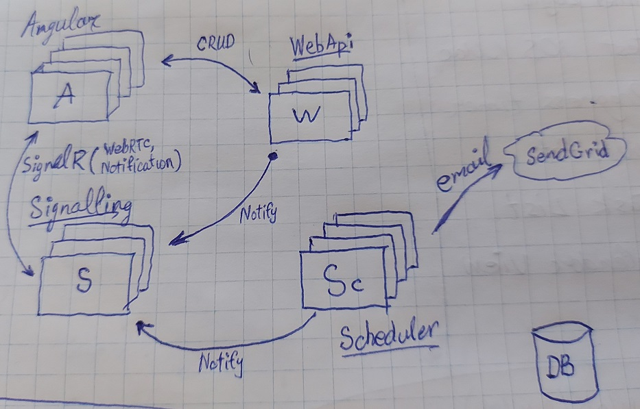

# Components

- **WebApp** - Client web application written in Angular
- **Signalling** - Asp.Net Core application. Runs SignalR hub that helps to make a call from server to web application.
- **WebApi** - Asp.Net WebApi project. Include controllers that helps to do CRUD actions and more.
- **Scheduler** - Background service that matched users on request dates. Written as .net hosted service.

